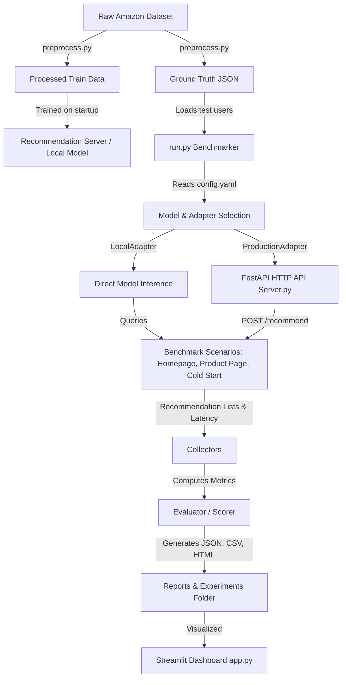

# Báo Cáo Kiến Trúc Hệ Thống (System Architecture Report)

Báo cáo này giải thích cấu trúc thư mục, vai trò của từng file và luồng dữ liệu chính trong Framework Kiểm Thử Hệ Gợi Ý (Recommendation Testing Framework).

---

## 1. Bản Đồ Thư Mục và Vai Trò của Từng Thành Phần

Thư mục chính `recommendation-testing` được thiết kế theo hướng module hóa cao độ để tách biệt giữa: dữ liệu, mô hình thuật toán, môi trường giả lập hành vi người dùng, bộ điều phối kiểm thử (benchmark), và giao diện trực quan hóa dashboard.

```text
recommendation-testing/
│
├── configs/
│   ├── config.yaml                  # Cấu hình hệ thống (mô hình, kịch bản, dataset, luồng chạy)
│   └── experiment.yaml              # Cấu hình thử nghiệm (seed, số lượt chạy, thư mục đầu ra)
│
├── datasets/
│   ├── raw/                         # Dữ liệu gốc (chứa file JSONL khổng lồ từ Amazon)
│   ├── processed/                   # Dữ liệu huấn luyện đã qua xử lý lọc và làm sạch
│   └── ground_truth/                # Dữ liệu kiểm thử thực tế của người dùng (Ground Truth)
│
├── models/                          # Các thuật toán hệ gợi ý (Recommender Models)
│   ├── base_recommender.py          # Lớp cơ sở định nghĩa Interface chung (train, recommend)
│   ├── collaborative_filtering.py   # Mô hình Lọc cộng tác (Collaborative Filtering)
│   ├── content_based.py             # Mô hình Gợi ý dựa trên nội dung (Content-Based)
│   ├── hybrid.py                    # Mô hình lai ghép kết hợp (Hybrid Recommender)
│   └── model_factory.py             # Factory pattern để khởi tạo model từ file cấu hình
│
├── adapters/                        # Cầu nối gọi mô hình (Service Adapters)
│   ├── base_adapter.py              # Interface định nghĩa phương thức lấy gợi ý
│   ├── local_adapter.py             # Gọi trực tiếp class Python trong bộ nhớ
│   └── production_adapter.py        # Gọi API HTTP POST tới server bên ngoài
│
├── scenarios/                       # Các kịch bản kiểm thử trải nghiệm (Testing Scenarios)
│   ├── homepage.py                  # Kịch bản trang chủ (không có sản phẩm đang xem)
│   ├── product_page.py              # Kịch bản trang chi tiết (có sản phẩm ngữ cảnh)
│   └── cold_start.py                # Kịch bản người dùng mới hoàn toàn (Cold Start)
│
├── collector/                       # Bộ thu thập dữ liệu kiểm thử (Collectors)
│   ├── recommendation_collector.py  # Ghi nhận kết quả gợi ý trả về (danh sách ID, điểm số)
│   └── latency_collector.py         # Đo đạc độ trễ (latency), SLA, tỉ lệ lỗi và timeout
│
├── evaluator/                       # Bộ đánh giá chất lượng gợi ý (Evaluator Suite)
│   ├── metrics.py                   # Triển khai các công thức Precision, Recall, NDCG, Diversity, HitRate
│   ├── scorer.py                    # Tính điểm trung bình trên toàn bộ kịch bản
│   ├── benchmark.py                 # Lập lịch chạy thử nghiệm và thu thập báo cáo tổng hợp
│   └── report_generator.py          # Xuất báo cáo kết quả ra JSON, CSV và HTML
│
├── dashboard/                       # Giao diện Streamlit tương tác trực quan (UI Dashboard)
│   ├── app.py                       # Điểm khởi chạy giao diện chính
│   ├── charts.py                    # Biểu đồ phân bố độ trễ SLA và độ chính xác
│   ├── comparison.py                # So sánh hiệu năng giữa các phiên bản thử nghiệm khác nhau
│   └── explorer.py                  # Xem danh sách gợi ý thực tế của từng User cụ thể
│
├── reports/                         # Chứa các báo cáo kết quả benchmark và phân tích hệ thống
│
├── preprocess.py                    # [Mới] Script tiền xử lý dữ liệu lớn bằng kỹ thuật streaming
├── server.py                        # [Mới] Server FastAPI chạy API kiểm thử URL thực tế
├── run.py                           # Tác vụ chạy benchmark từ đầu đến cuối (End-to-End Orchestrator)
└── requirements.txt                 # Danh sách các thư viện Python phụ thuộc
```

---

## 2. Luồng Vận Hành Chính của Framework (System Flow)

Framework vận hành theo một luồng khép kín từ khâu chuẩn bị dữ liệu cho đến khi báo cáo kết quả:



### Chi tiết luồng thực thi trong `run.py`:
1. **Load Configurations**: Nạp tham số kiểm thử từ [config.yaml](file:///c:/Users/ADMIN/OneDrive/M%C3%A1y%20t%C3%ADnh/recsAmazon/recommendation-testing/configs/config.yaml) và [experiment.yaml](file:///c:/Users/ADMIN/OneDrive/M%C3%A1y%20t%C3%ADnh/recsAmazon/recommendation-testing/configs/experiment.yaml).
2. **Data Initialization**: Đọc dữ liệu huấn luyện đã xử lý lọc và danh sách ground truth.
3. **Model Training & Setup**: Khởi tạo mô hình thuật toán phù hợp thông qua `ModelFactory` và tiến hành huấn luyện (`train()`) mô hình trên dữ liệu đã chuẩn bị.
4. **Adapter Integration**:
   - Nếu chạy kiểm thử nội bộ (`adapter.type == "local"`): dùng `LocalAdapter` kết nối trực tiếp với đối tượng model trong RAM.
   - Nếu chạy kiểm thử thực tế qua mạng (`adapter.type == "production"`): kết nối tới API URL thông qua `ProductionAdapter` qua giao thức HTTP POST.
5. **Scenario Run**: Duyệt qua danh sách kịch bản (Homepage, ProductPage, ColdStart). Với mỗi kịch bản, bộ giả lập sẽ gửi danh sách User ID thích hợp đến Adapter để lấy kết quả gợi ý.
6. **Metric Calculation**: Chuyển giao danh sách gợi ý thu thập được cho lớp `Scorer` để tính toán các chỉ số chất lượng (Precision, Recall, NDCG, Diversity, HitRate) bằng cách đối chiếu với Ground Truth.
7. **Report Production**: Tạo ra các báo cáo dạng JSON, CSV và HTML lưu vào thư mục `reports/` và `experiments/` tương ứng.

---

## 3. Lý Do Thiết Kế & Giải Pháp Tối Ưu Hóa

- **Tách biệt Model và Adapter**: Thiết kế này giúp chúng ta đánh giá mô hình bằng hai chế độ khác nhau mà không cần thay đổi bất kỳ dòng mã nguồn nào của thuật toán. Ta có thể kiểm thử tốc độ suy diễn thuần túy của Python (`LocalAdapter`) hoặc đo đạc độ trễ thực tế qua mạng (`ProductionAdapter`) khi deploy mô hình lên production (ví dụ server FastAPI).
- **Thiết kế Scenario độc lập**: Mỗi kịch bản kiểm thử (Homepage, Product Page, Cold Start) được cài đặt như một class riêng biệt thực thi phương thức `execute()`. Khi hệ thống cần mở rộng thêm các kịch bản mới (như giỏ hàng, kịch bản theo thời gian thực...), lập trình viên chỉ cần tạo thêm class Scenario mới mà không ảnh hưởng tới lõi benchmark.
